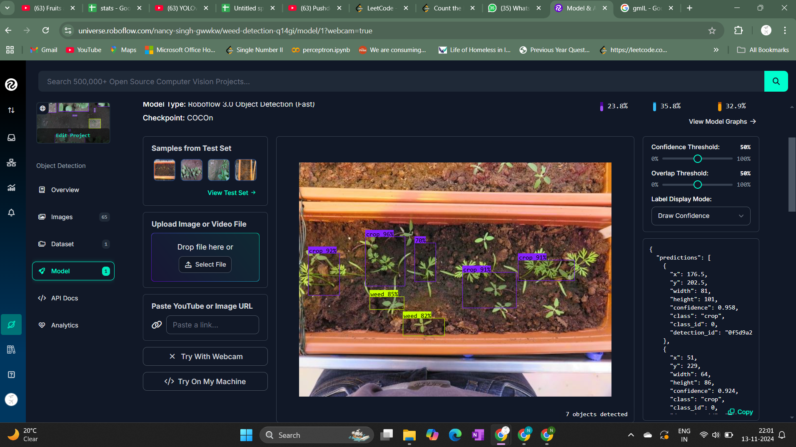

# Weed Detection using Roboflow and YOLOv5

This project demonstrates the integration of Roboflow’s object detection API with YOLOv5 to detect weeds in images. It uses pre-trained models, performs inference on images, and visualizes the results such as bounding boxes and confidence scores. Additionally, it provides insights into detection results through graphs like confidence distributions and class distributions.

 <!-- Replace with actual image path -->

## Features

- **Object Detection**: Detects weeds in images using a pre-trained YOLOv5 model hosted on Roboflow.
- **Bounding Boxes & Labels**: Visualizes detection results with bounding boxes and confidence labels.
- **Confidence Distribution**: Plots a histogram of the confidence scores for all detected objects.
- **Class Distribution**: Shows the count of each detected object class.
- **Average Confidence per Class**: Displays a bar chart showing the average confidence score for each detected class.

## Prerequisites

Before running the code, ensure that the following dependencies are installed:

- **Python 3.x**: Ensure you are using Python 3.x for compatibility.
- **Required Python Libraries**:
  - `roboflow`: To interact with the Roboflow API.
  - `yolov5`: For running YOLOv5 models.
  - `opencv-python`: For image processing and visualization.
  - `matplotlib`: For creating graphs and visualizations.
  - `tensorboard`: For tracking model performance.

### Installation

You can install the required dependencies using the following commands:

```bash
pip install roboflow
pip install yolov5
pip install tensorboard
pip install opencv-python
pip install matplotlib
